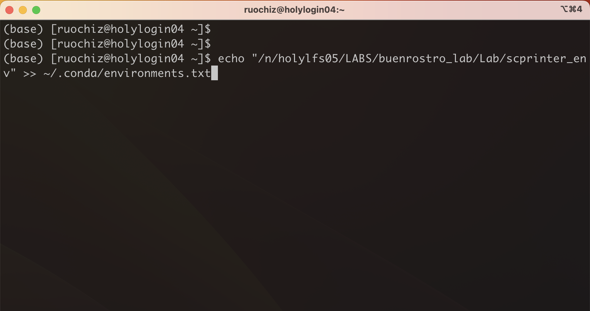
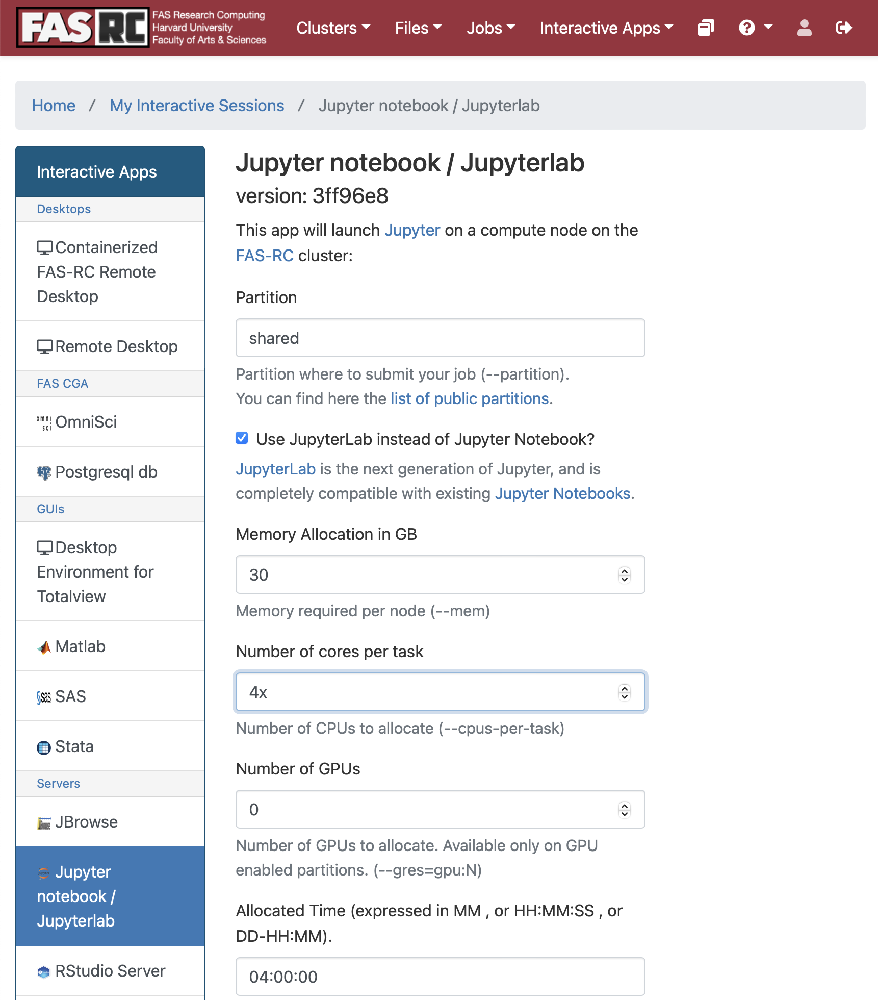
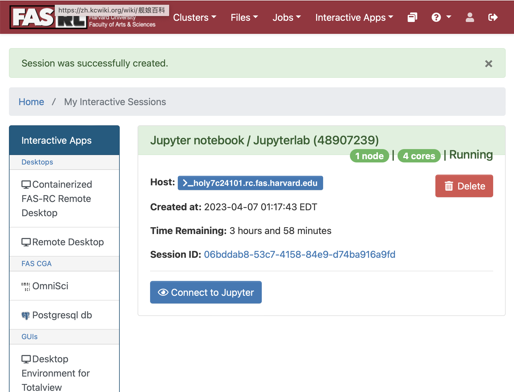
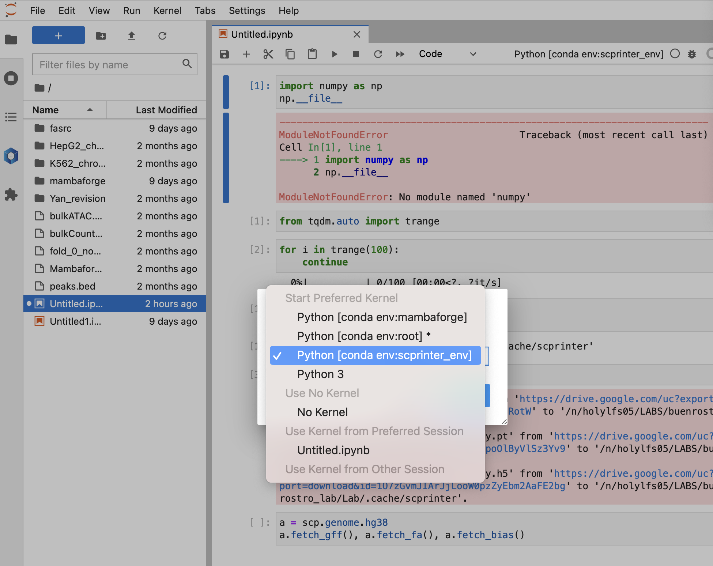

# Start to use

If you want to run it on your machine, workstation, talk to Ruochi or Yan.

For beta testing, you can use it on fasrc following this procedure:

1. Log in to fasrc
2. Run this command in shell
3. Note that our environment move to "/n/holylfs06/"

```
echo "/n/holylfs06/LABS/buenrostro_lab/Lab/scprinter_env" >> ~/.conda/environments.txt
```

After that, `scprinter_env` should appear in your jupyter-lab ipykernel list.



3. Start jupyter-lab in your preferred way. One example would be using interactive apps of fasrc. Connect to fasrc,
   and then go to `https://vdi.rc.fas.harvard.edu`


Select Jupyter nobook / Jupyter lab



Put in the memory and cores you want to use.


Click Launch

4. **Important** Create a new notebook, and select ipykernel with `scprinter_env` environment.
   
   

You can start to use scprinter now! :laughing:


